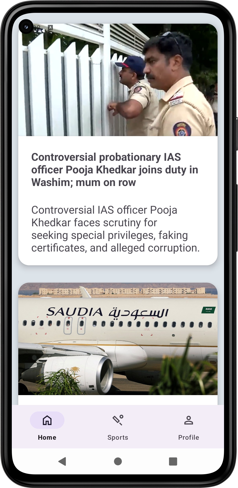
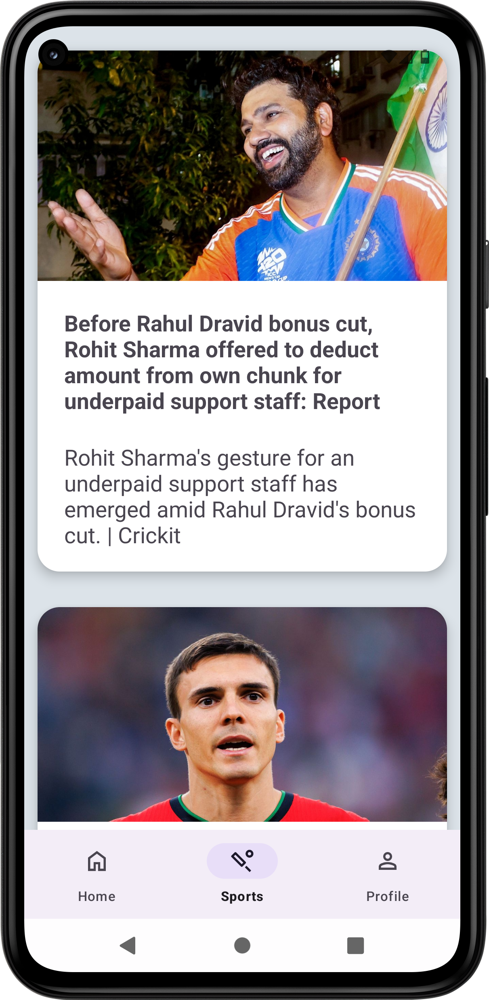
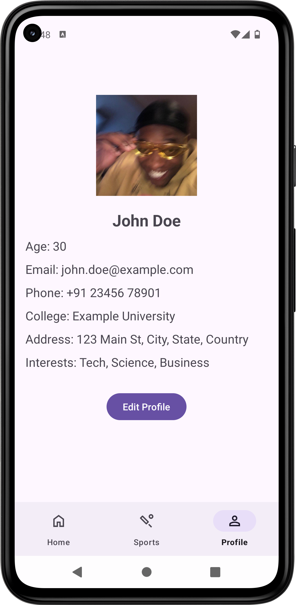

# Headline-Hub
## Project Overview
Stay informed and in control with "Headline-Hub," your one-stop app for staying on top of the world. Navigate seamlessly with the intuitive bottom bar, where you can access breaking global headlines, the latest sports news, and even your personalized profile page. "Headline-Hub" empowers you to stay connected to what matters, all in a user-friendly and streamlined experience.
## Features
<p align="center">
  
   
  
</p>


## Installation
1) Fork this repository.
2) Clone the repository:
```bash
git clone https://github.com/ayushsaksena30/Headline-Hub.git
```
4) Open the project in Android Studio.

Build and run the app on your connected device using Android Studio.

Note: Make sure you have the necessary dependencies and Android SDK installed to build and run Android apps.
